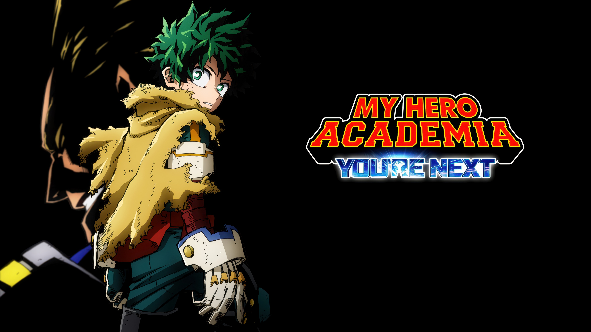

# My Hero Academia — Web Interactiva
**Autor:** Nicolás Báez

## 📌 Descripción
¡Bienvenido a mi proyecto web inspirado en el universo de **My Hero Academia**!  
En esta app podés explorar héroes, villanos y sus dones, con tarjetas interactivas, animaciones y diseño responsivo.

---

## 🎥 Vista previa en video

📺 Podés ver una demostración del proyecto en este video de YouTube:  
🔗 [No Disponible]

---

## 🚀 Tecnologías utilizadas

- **HTML** y **SCSS** (estructura modular dividida por `components`, `layouts`, y `utils`)
- **JavaScript Vanilla** para manipulación dinámica del DOM en ranking.html
- **Bootstrap 5** para diseño responsivo
- **Animate.css** para animaciones suaves al cargar contenido
- **SweetAlert2** para futuros mensajes y alertas interactivas
- **Favicon** incluido en la pestaña del navegador
- Estructura basada en BEM y buenas prácticas de organización de carpetas
- Diseño centrado en la experiencia del usuario y la accesibilidad

---

## 🧪 Estado actual

- ✅ Página de **Inicio** con carrusel y cards de personajes.
- ✅ Página de **Personajes** con información detallada de héroes y villanos.
- ✅ Página de **Dones** con GIFs ilustrativos para cada quirk.
- ✅ Página de **Openings** con carrusel y links a YouTube.
- ✅ **Ranking** — Comparativa de poder dinámica.
- ✅ Página de **Sucesos** con **línea del tiempo dual** (serie y películas).
- ✅ Página de **Nosotros** con Aclaración legal y origen del proyecto.
- ✅ Página de **Contacto** con formulario simulado de sugerencias, errores o fanarts.
- 🔧 Mejoras continuas en navegación, accesibilidad y experiencia responsive.

---

## 🧪 Funcionalidades

### 🏠 **Inicio**
- Carrusel de imágenes con Bootstrap.
- Cards interactivas de personajes principales.

### 🦸‍♂️ **Personajes**
- Cards informativas con imágenes, texto y diseño responsive.
- Héroes y villanos destacados.

### ⚡ **Dones**
- Galería de *quirks* con GIFs y descripciones.
- Animaciones al ingresar.

### 🎵 **Openings**
- Carrusel visual con links a YouTube.
- Experiencia audiovisual para fans.

### 📈 Ranking de Poder ✅
- **Sección dinámica generada con JavaScript**
- Cards con diseño tipo "ficha" para cada personaje
- Incluye:
  - Imagen GIF animada
  - Nombre, rol (héroe o villano)
  - Descripción del personaje
  - Barra de poder (visual + valor numérico)

### 🗓️ **Sucesos**
- Línea del tiempo dual (serie y películas).
- Cronología visual fácil de explorar.

### 👥 **Nosotros**
- Sección informativa que explica el objetivo del sitio.
- Se aclara que es un proyecto hecho por un fan sin fines de lucro.
- Se detalla que **no es oficial ni está afiliado** a los creadores de *My Hero Academia*.
- Incluye datos del desarrollador.

### ✉️ **Contacto**
- Página con formulario funcional simulado (sin backend).
- Campos: nombre, email, motivo y mensaje.
- Validación de campos y feedback visual con SweetAlert2.
- Se accede mediante un **botón flotante** visible en toda la app.

---

### 🛠️ Mejoras en desarrollo

- 🔄 Optimización progresiva del **SEO**  
  Títulos dinámicos y optimizados por página, metadescripciones claras, etiquetas `<meta>` y `<og>` personalizadas para cada sección del sitio.
- 🔧 Mejoras en la **navegación** y experiencia responsive  
  Se continúa trabajando en la jerarquía de encabezados, accesibilidad, interacciones móviles y navegación entre secciones.
- ⚙️ Refactorización de código SCSS  
  Limpieza y optimización de estilos, reducción de redundancia y modularización para un mantenimiento más sencillo y eficaz.

---

## 🚀 **Sitio desplegado en Vercel**  
👉 Accedé a la versión en línea desde:  
🌐 [https://plusultra-web.vercel.app](https://plusultra-web.vercel.app)

---

## 📌 Autor

**Nicolás Báez**  
💻 Proyecto para práctica y portfolio personal  
🔗 [Mi GitHub](https://github.com/114032-Baez-Nicolas)

---

## 💥 ¡Plus Ultra!

Este proyecto fue creado con muchísima pasión por el mundo de My Hero Academia.  
Cada detalle está pensado para que disfrutes explorarlo tanto como yo disfruté crearlo.  
¡Y todavía queda mucho por sumar!
